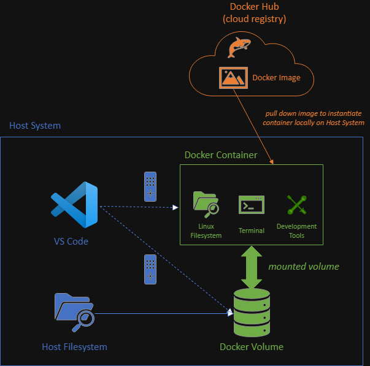

# Docker Primer

## Introduction

This brief primer discusses Docker at a conceptual level.

> [!IMPORTANT]
> ***High-level idea/summary***: Docker containerizes applications, thereby addressing the "but it works on my machine" problem.

***Document Outline***:

```
Background
  VMs vs. Containers
  Docker Primitives
More Advanced Docker Setups
```

## Background

### VMs vs. Containers

The general purpose of Docker is to ***containerize*** an application, in order to create a ***standardized*** environment that is ***portable*** on a machine-to-machine basis. This in turn addresses a longstanding ***issue*** in the  field of software development:

> "But it works on ***my*** machine, though!" (i.e., but not necessarily others' machines)

The implications of this should be self-evident for a large organization, 100+ students course section, etc., particularly insofar as standardization, troubleshooting, etc. are concerned.

This is analogous to what a Virtual Machine (VM) has already accomplished previously, but the approach is fundamentally distinct, as the following [depiction](https://dazzyddos.github.io/posts/Docker-Build-Stage-Security-Best-Practices/) shows/contrasts:

<center>

</center>

With a VM, the entire toolchain (***including*** the [guest] operating system) is provided as part of the standardized environment. Conversely, Docker uses **containers**, which are specified/configured on a per-application basis for the equivalent purpose, running on the corresponding **container engine** (which manages the sharing of resources, isolation between containers and from host, etc., serving an analogous role to the VM's ***hypervisor***).

> [!WARNING]
> It's ***not*** necessarily accurate to say that there is a relative efficiency/inefficiency between a VM vs. a Docker container per se. While in general Docker containers are intended to be relatively lightweight by design, nevertheless a VM can be packaged efficiently, a Docker container can be specified and/or implemented inefficiently, etc.
> In either case, both VMs and containers will generally add net overhead relative to running "on bare metal" (i.e., directly on the hardware, without a virtualization layer in between), with the optimization goal being to minimize this overhead accordingly.

### Docker Primitives

With respect to Docker itself, there are a few core **primitives** involved, summarized as follows (among others):

| Primitive | Description | Docs Reference |
|:-|:-|:-|
| Engine | The virtualization layer, which manages the Docker resources. This is installed automatically on the host system via [Docker Desktop](https://docs.docker.com/desktop/), which in turn provides a GUI to manage and interact with the various Docker components. | [Docker Engine](https://docs.docker.com/engine/) |
| Image | A schematic/blueprint for creating containers. | [Dockerfile reference](https://docs.docker.com/reference/dockerfile/) |
| Registry | A cloud-based repository for hosting and distributing Docker images. [Docker Hub](https://hub.docker.com/) is the canonical Docker registry, but it is also possible to self-host registries, and this is also a commonly provided service on major cloud platforms (e.g., AWS, Azure, GCP, etc.). | [Docker Hub overview](https://docs.docker.com/docker-hub/) |
| Container | An ephemeral environment for running an application. The environment is specified by the corresponding Docker image, and has a consistent starting state based on this specification, immediately upon the container's creation. A container generally runs as an isolated process (both with respect to the host system and other containers), with correspondingly specified interaction/functionality being "opted into" (i.e., but otherwise "opted out of"/"maximally isolated" by default). | [Docker Containers](https://docs.docker.com/engine/containers/run/) |
| Volume | Volumes (and related bind mounts) provide persistent, shared storage both across containers as well as independently of the lifetime/uptime of any given container(s). | [Storage](https://docs.docker.com/engine/storage/) |

> [!NOTE]
> See [here](https://docs.docker.com/get-started/docker-overview/#docker-architecture) for further discussion of these topics. More generally, the [Docker documentation](https://docs.docker.com/) is very comprehensive and well written.

> [!NOTE]
> Regardless of the host system (i.e., macOS, Windows, or Linux), the Docker Engine itself is ***Linux-based***.
>
> In the case of a ***Windows*** host, the corresponding Linux-based virtualization is provided by [WSL](https://aka.ms/wsl) (Windows Subsystem for Linux). Prior to introduction of WSL, Docker on Windows was virtualized using Hyper-V (which is still [supported](https://docs.docker.com/desktop/install/windows-install/), but WSL is generally recommended).

Diagrammatically, the relationship between these primitives is as follows:

<center>

</center>

As depicted here:
  * The ***Docker Container*** is a running process, which is isolated from the ***Host System*** and is specified from its originating ***Docker Image***. 
  * Furthermore, the Docker Image itself need not be present locally, but rather can also be hosted in a cloud-based ***registry*** (e.g., ***Docker Hub***) for subsequent retrieval/usage.
  * Additionally, the container can be specified/configured in such a manner by which "***remote***" ***interaction*** from the host is readily available/possible (i.e., via VS Code or equivalent), including common/mutual sharing of files via mounted ***Docker Volumes***.

## More Advanced Docker Setups

Beyond this, more ***complex*** configurations are also possible, such as multi-container assemblies (which can be specified declaratively via [Docker Compose](https://docs.docker.com/compose/) files) interconnected via [networks](https://docs.docker.com/engine/network/) for DNS-like container-to-container communication (in addition to persisting storage and/or sharing data via volumes, etc.). This is particularly ubiquitous in modern microservices-based architectures, which can be readily provisioned and hosted on cloud-based infrastructure (many/most of which support Docker as a first-class service, along with related orchestration tools such as Kubernetes).
